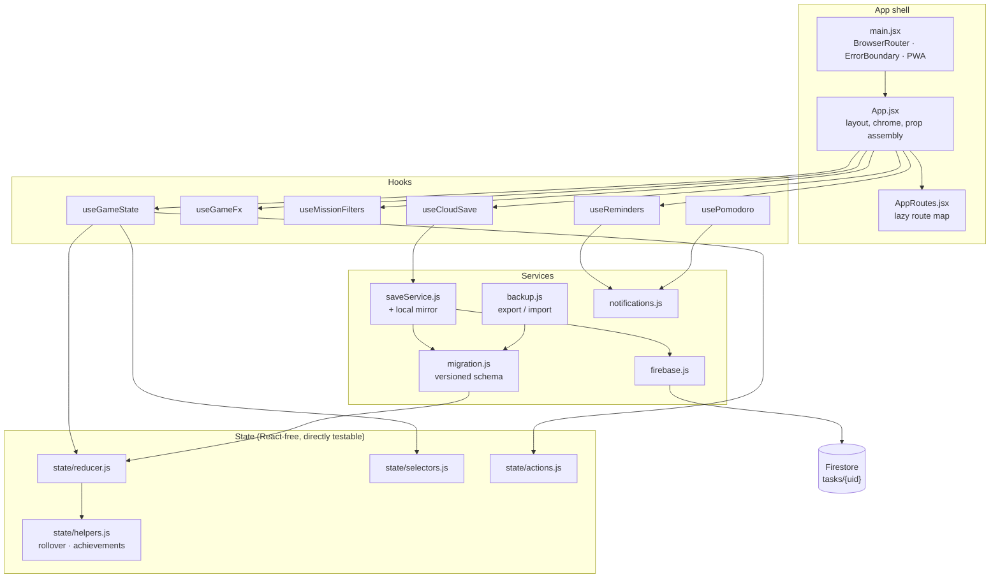

<div align="center">


# ARISE — Hunter Command Center

**A gamified daily task manager inspired by _Solo Leveling_.**
Clear missions, earn XP, hold your streak, and climb from E-Rank to National-Level.


</div>

---

## Screenshots

> **Not yet captured.** The shots below are the ones worth having; drop the
> files into `docs/screenshots/` with these names and they will render here.
> Run `npm run dev`, then capture at 1440×900 for desktop and 390×844 for mobile.

| | |
| --- | --- |
| **Dashboard** — rank badge, streak, daily quest, today's gates<br>`docs/screenshots/dashboard.png` | **Mission Board** — filters, drag & drop, recurrence chips<br>`docs/screenshots/tasks.png` |
| **Analytics** — completion rate, XP curve, activity heatmap<br>`docs/screenshots/analytics.png` | **Calendar** — month/week, priority colours, multi-day spans<br>`docs/screenshots/calendar.png` |
| **Habits** — streaks, weekly/monthly progress, habit calendar<br>`docs/screenshots/habits.png` | **Level-up cinematic** — the money shot for the GIF<br>`docs/screenshots/demo.gif` |

A good 10-second demo GIF: create a mission → drag it up the board → clear it →
catch the XP burst and level-up overlay → land on `/analytics`.

---

## Features

### Missions
- **Mission board** with difficulty tiers (E → S), categories, priorities and XP rewards
- **Recurring missions** — daily, weekly, monthly or a custom N-day interval. Clearing one
  spawns the next occurrence automatically while the cleared card keeps its history.
  **Skip** an occurrence, **pause** a series, **resume** it later
- **Drag & drop ordering** with pointer, touch and full keyboard support; the order is
  persisted, and reordering a filtered view never disturbs missions that were off screen
- **Deadlines** — due date and time, a live countdown, Today / Tomorrow / "Overdue · 3d"
  badges and a red rail down overdue cards
- **Multi-day missions** that span a date range on the calendar
- **Reminders** — 5 min / 15 min / 30 min / 1 hour / 1 day before, as browser
  notifications. Permission is asked exactly once
- **Advanced filters** — category, priority, difficulty, XP range, completed, pending,
  overdue, due today, due this week, recurring, and title search. All compose together

### Progression
- **Daily quest** — pick 4 required missions; clear them all to extend your streak
- **The Resolve system** — the game rewards consistency, not perfection. See below
- **Hunter ranks** earned by unbroken streak: E → D (21d) → B (90d) → S (180d) →
  National (365d), each with its own aura, glow and promotion cinematic
- **XP + levels** on a rising curve, with level-up overlays and floating XP bursts
- **Achievements** swept automatically as you play

### The Resolve system

A missed day is the moment a hunter is most likely to quit, so it is the moment
the app has to be warmest. Nothing here can take XP, levels, achievements or a
personal best away — **power once earned is permanent**. Only the current streak
is ever at stake, and it gets two chances before it goes:

| Situation | What happens | What you see |
| --- | --- | --- |
| Cleared the daily quest | Streak +1. Every 7th day forges a **Streak Shield** (max 3) | `STREAK SHIELD FORGED` |
| Missed a day, shield banked | A shield is spent; the streak is **untouched** | `SHIELD HELD` |
| Missed a day, no shields | The streak is **held for one day**, not destroyed | `STREAK PRESERVED` |
| Cleared the quest during that day | The whole climb returns, plus a comeback bonus | `STREAK RECOVERED` |
| That day passed too | The streak settles; the old run stays on your record | `A NEW CLIMB BEGINS` |

There is no failure screen. No red, no shake, no "you failed" — the word doesn't
appear in the product. Coming back is treated as the skill it is, with its own
achievement line (`Nothing Kept Me Down`, `Always Returns`, `Fully Resolved`).

### Beyond missions
- **Habit tracker** — daily logging, weekly/monthly progress against a cadence, streaks,
  consistency percentage, XP per log and a back-fillable month calendar
- **Productivity analytics** — completion rate, XP this week/month, current and longest
  streak, most-completed category, average tasks per day, a weekly completion chart,
  an 8-week XP curve, a category split and a four-month activity heatmap
- **Pomodoro timer** — 25/5 by default with custom durations, pause/resume/reset/skip,
  a notification and a chime on finish. Keeps running across route changes
- **Calendar** — month and week views, drag missions between dates, priority colours,
  recurring indicators and quick-add on any day

### Platform
- **Cloud sync** — Firebase Auth (email/password + Google), one save document per user
- **Offline** — Firestore IndexedDB persistence plus a local mirror; edit offline and
  everything syncs on reconnect
- **Installable PWA** with offline caching and a non-intrusive update prompt
- **Guest mode** — explore the whole UI signed out; protected actions prompt to sign in
  and resume where you left off
- **Themes** — Arcane, Shadow, Frost and Ember, plus an animation toggle and dimmed ambience
- **Export / import** — JSON (round-trippable) and CSV (spreadsheet-friendly), with
  validation and a confirmation summary before anything is replaced
- **Accessible** — keyboard navigation throughout, visible focus rings, ARIA labels and
  live-region announcements for the otherwise-silent cinematics

---

## Architecture



**Two design decisions worth knowing about:**

1. **One document, versioned in the payload.** The entire game state lives at
   `tasks/{uid}` as a JSON string. Rather than versioning collections, the payload
   carries a `version` and is upgraded in place on load by `services/migration.js`.
   Migration is idempotent and forward compatible — fields written by a newer client
   survive a round trip through an older one.

2. **The reducer knows nothing about React.** Every transition lives in `src/state/`,
   which is why the state machine can be driven directly from tests. That's how the
   pomodoro pause bug and the missing-`history` migration gap were both caught.

---

## Getting Started

**Prerequisites:** Node.js 20+ and npm.

```bash
npm install
```

```bash
npm run dev
```

The app runs at **http://localhost:5173**. You can explore the whole interface as a
guest — sign-in is only needed to persist anything.

| Command | What it does |
| --- | --- |
| `npm run dev` | Vite dev server with HMR |
| `npm run build` | Production build → `frontend/dist` |
| `npm run preview` | Serve the production build locally |
| `npm test` | Run the test suite once |
| `npm run test:watch` | Re-run tests on change |
| `npm run test:coverage` | Coverage report (v8 + HTML) |

---

## Folder Structure

```
├── frontend/
│   ├── public/icons/            # PWA icon set (192/512 + maskable)
│   ├── src/
│   │   ├── components/          # UI, grouped by feature
│   │   │   ├── analytics/       # chart frame, heatmap calendar
│   │   │   ├── auth/            # AuthGate, login modal, auth form
│   │   │   ├── background/      # three.js battlefield scene, particles
│   │   │   ├── calendar/        # day cell, draggable mission chip
│   │   │   ├── cinematic/       # welcome intro
│   │   │   ├── filters/         # filter bar and chips
│   │   │   ├── habits/          # habit card, calendar, add form
│   │   │   ├── mission/         # deadline, recurrence, reminder, actions
│   │   │   ├── settings/        # preferences, defaults, data panels
│   │   │   └── ui/              # skeletons, boot screen, error boundary, PWA prompt
│   │   ├── pages/               # Dashboard, Missions, Calendar, Habits,
│   │   │                        # Analytics, Achievements, Settings
│   │   ├── state/               # reducer, helpers, actions, selectors (no React)
│   │   ├── hooks/               # useGameState, useGameFx, usePomodoro,
│   │   │                        # useReminders, useCloudSave, useMissionFilters…
│   │   ├── services/            # firebase, saveService, migration, backup, notifications
│   │   ├── utils/               # date, recurrence, filters, analytics, habits, calendar
│   │   ├── game/                # rules: levels, ranks, achievements, constants
│   │   ├── data/                # difficulties, categories, templates
│   │   ├── test/                # Vitest setup + factories
│   │   ├── routes.js            # single source of truth for URLs
│   │   ├── AppRoutes.jsx        # URL → screen map
│   │   └── App.jsx              # layout, chrome, prop assembly
│   ├── vite.config.js           # build, chunking, PWA
│   └── vitest.config.js         # test environment
├── firestore.rules              # per-user access rules
├── netlify.toml                 # SPA deploy config
└── .github/workflows/           # CI: build + Trivy scan
```

Files are kept under roughly 300 lines; anything larger is split by responsibility.

---

## Tech Stack

| Layer | Tech |
| --- | --- |
| UI | React 18, Vite 6, Tailwind CSS 4, framer-motion, lucide-react |
| Routing | React Router 6, lazy routes + manual vendor chunking |
| Charts | Recharts |
| Drag & drop | dnd-kit (core, sortable, modifiers) |
| Effects | three.js / react-three-fiber, tsparticles, GSAP |
| Auth | Firebase Authentication (email/password, Google) |
| Data | Cloud Firestore, one save document per user, IndexedDB persistence |
| Offline | vite-plugin-pwa + Workbox |
| Testing | Vitest, React Testing Library, jsdom |

---

## Testing

```bash
npm test
```

258 tests across 14 files, covering the XP curve and rank thresholds, the recurrence
engine, filters, analytics, habit maths, calendar and deadline helpers, schema
migration, backup validation, the full reducer, auth, the pomodoro state machine and
mission-card rendering.

Component tests query by accessible role and name, so they double as an accessibility
check.

---

## Firebase Setup

To point the app at your own Firebase project:

1. Create a project at [console.firebase.google.com](https://console.firebase.google.com)
2. Enable **Authentication** → Email/Password and Google
3. Create a **Cloud Firestore** database
4. Publish the rules from [`firestore.rules`](firestore.rules)
5. Replace the web config in
   [`frontend/src/services/firebase.js`](frontend/src/services/firebase.js)

The web config is public by design — security comes from Auth plus the Firestore rules,
which restrict every user to their own `tasks/{uid}` document.

---

## Deployment

The build is a plain SPA, so any static host works.

- **Netlify** — config in [`netlify.toml`](netlify.toml), publishes `frontend/dist`
  with an SPA fallback so deep links resolve
- Add your production domain to **Firebase Auth → Authorized domains**
- Serve over HTTPS: the service worker and notifications both require it

---

## Roadmap

- [ ] Sub-tasks and checklists inside a mission
- [ ] Guilds — shared boards and co-op daily quests
- [ ] Calendar import from Google Calendar / .ics
- [ ] Focus statistics from pomodoro sessions, folded into analytics
- [ ] Push notifications via FCM so reminders fire with the app closed
- [ ] Rich habit types (counters and durations, not just done/not-done)
- [ ] Per-mission time tracking
- [ ] Widgets and a mobile home-screen quick-add shortcut

---

## License

MIT — see [LICENSE](LICENSE).
